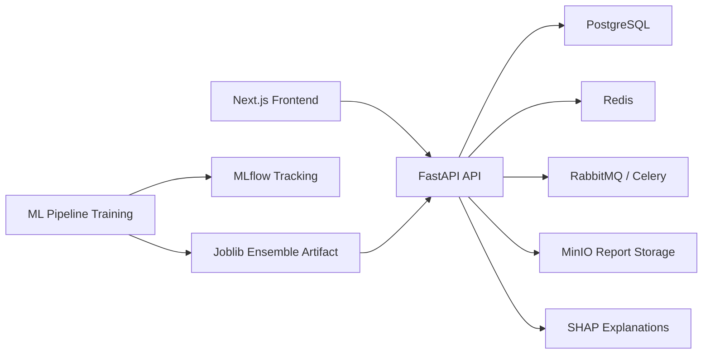

# PCOS Prediction System

Production-oriented PCOS screening workspace built with a FastAPI backend, a Next.js frontend, and a shared scikit-learn/XGBoost ML pipeline. This version intentionally removes Docker from the stack and is designed to run against locally installed or managed services.

## What This Project Includes

- Next.js patient, doctor, and admin experiences with TailwindCSS, Axios, and Recharts.
- Patient draft saving, doctor assignment workflow, and clinician notes for a more realistic clinic demo.
- FastAPI API with JWT auth, refresh cookies, RBAC, SQLAlchemy models, Alembic migrations, audit logging, PDF reports, and model hot-swap support.
- Shared ML pipeline for Random Forest, XGBoost, Logistic Regression, SHAP explainability, and MLflow artifact logging.
- PostgreSQL-first schema with Redis, RabbitMQ, MinIO, and MLflow integration points for local or managed deployments.

## Architecture



Architecture diagram description: the Next.js client submits patient features to FastAPI, FastAPI stores user and prediction state in PostgreSQL, uses Redis and RabbitMQ/Celery for background work, writes PDF outputs to MinIO-compatible storage, and loads the trained ensemble artifact produced by the shared ML pipeline. MLflow tracks training runs and the backend uses SHAP to explain the final risk score.

## Directory Layout

```text
pcos-prediction/
├── frontend/
├── backend/
├── ml_pipeline/
├── .github/workflows/ci.yml
├── .env
├── .env.example
└── README.md
```

## Local Setup

1. Ensure these services are available locally or via managed endpoints:
   PostgreSQL, Redis, RabbitMQ, MinIO.
2. Review the environment file in [`/.env`](C:\Users\91982\Desktop\MCA\pcos prediction system\pcos-prediction\.env) or copy values from [`/.env.example`](C:\Users\91982\Desktop\MCA\pcos prediction system\pcos-prediction\.env.example).
3. Install backend dependencies:

```bash
cd backend
python -m pip install -r requirements.txt
```

4. Apply migrations:

```bash
cd backend
alembic upgrade head
```

5. Train the ensemble artifact:

```bash
cd ..
python ml_pipeline/train.py
```

6. Start the API:

```bash
cd backend
uvicorn app.main:app --reload
```

7. Start the frontend:

```bash
cd ../frontend
npm install
npm run dev
```

## API Docs

- Swagger UI: [http://localhost:8000/docs](http://localhost:8000/docs)
- OpenAPI JSON: [http://localhost:8000/api/v1/openapi.json](http://localhost:8000/api/v1/openapi.json)

## Key API Routes

- `POST /api/v1/auth/register`
- `POST /api/v1/auth/login`
- `POST /api/v1/auth/refresh`
- `GET /api/v1/auth/me`
- `POST /api/v1/predict`
- `GET /api/v1/patients`
- `GET /api/v1/patients/{id}/history`
- `GET /api/v1/patients/me/draft`
- `PUT /api/v1/patients/me/draft`
- `PUT /api/v1/patients/{id}/assignment`
- `POST /api/v1/patients/{id}/notes`
- `GET /api/v1/reports/{prediction_id}`
- `GET /api/v1/admin/stats`
- `GET /api/v1/admin/doctors`
- `PUT /api/v1/admin/model/deploy`

## Database Schema

The PostgreSQL schema is defined through Alembic and includes the five required core tables:

- `users`
- `patients`
- `lab_results`
- `predictions`
- `audit_log`

Indexed columns include `user_id`, `patient_id`, `created_at`, and `timestamp` where appropriate.

For the heavier MCA workflow, the project also adds:

- `organizations`
- `patient_assignments`
- `patient_drafts`
- `clinician_notes`

## ML Pipeline

Training flow:

1. Load the Kaggle PCOS dataset and coerce noisy non-numeric values safely.
2. Apply median imputation and feature engineering.
3. Engineer `LH/FSH Ratio`, `BMI Category`, `Cycle Irregularity Score`, `Testosterone z-score`, and `AMH Percentile`.
4. Train Random Forest, XGBoost, and Logistic Regression with an 80/20 stratified split.
5. Build a soft-voting ensemble for the final risk score.
6. Log metrics and artifacts to MLflow.
7. Use a tree-based SHAP explainer from the strongest tree model for per-prediction feature impact ranking.

## Model Performance

Metrics below are from the trained `v1.3.0` artifact generated from the included dataset on April 2, 2026.

| Model | Accuracy | Precision | Recall | F1 | ROC-AUC |
| --- | ---: | ---: | ---: | ---: | ---: |
| Random Forest | 0.927 | 0.938 | 0.833 | 0.882 | 0.956 |
| XGBoost | 0.927 | 0.938 | 0.833 | 0.882 | 0.955 |
| Logistic Regression | 0.908 | 0.842 | 0.889 | 0.865 | 0.955 |
| Ensemble | 0.917 | 0.909 | 0.833 | 0.870 | 0.965 |

Champion base model by ROC-AUC: `Random Forest`

Ensemble confusion matrix over the full dataset during evaluation:

```text
[[361, 3],
 [  7, 170]]
```

## Dataset Source

- Kaggle: [PCOS Data](https://www.kaggle.com/datasets/shreyasvedpathak/pcos-dataset)

## Frontend Pages

- `/login`: combined login and registration flow with role selection.
- `/patient`: multistep patient intake, draft save-and-resume, risk gauge, SHAP bar chart, and report viewer.
- `/doctor`: assigned-patient queue, risk filtering, trend chart, and clinician notes.
- `/admin`: active-user stats, model governance summary, patient-to-doctor assignment, and audit log feed.

## CI/CD

The GitHub Actions workflow in [`/.github/workflows/ci.yml`](C:\Users\91982\Desktop\MCA\pcos prediction system\pcos-prediction\.github\workflows\ci.yml) runs:

- `flake8` on the backend
- `pytest` for backend smoke tests
- `next lint`
- `jest`
- `next build`
- staging bundle packaging and optional SCP deployment when staging SSH secrets are configured

## Notes

- The enforced `/predict` schema uses the requested clinical inputs exactly.
- Because serum testosterone is not present in that enforced request schema, the pipeline derives a clinically motivated androgen proxy to compute the required testosterone z-score feature.
- The default MLflow tracking URI uses a local file store for convenience in development; for long-term deployments, switch to a database-backed MLflow store.
